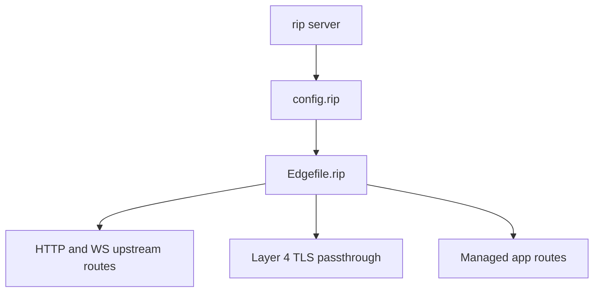
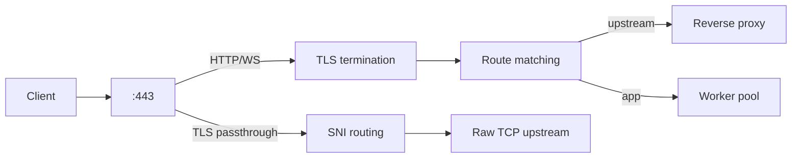
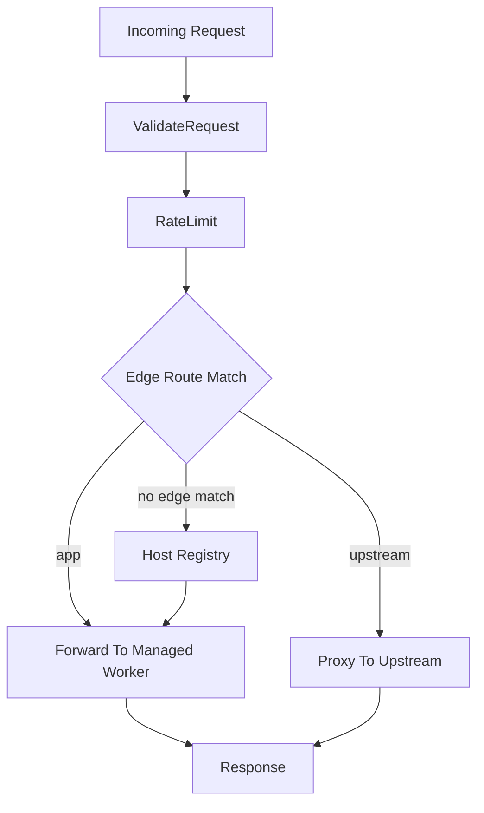

 <br>

# Rip Server - @rip-lang/server

> **One runtime for your app and your edge — web framework, reverse proxy, TLS passthrough, and managed workers in a single zero-dependency Bun-native server**

Rip Server replaces the combination of a web framework (Express, Hono), a
process manager (PM2), and a reverse proxy (Nginx, Caddy, Traefik) with one
unified runtime. Define your API with Sinatra-style routes, serve it with
managed multi-worker processes, proxy external services, and pass through raw
TLS for things like the Incus Web UI — all from a single `rip server` command
with zero external dependencies.

Written entirely in Rip. Runs on Bun.

## Features

### App Framework
- **Sinatra-style routing** — `get`, `post`, `put`, `del` with path parameters and wildcards
- **Request validation** — 40+ built-in validators via [`read()`](docs/READ_VALIDATORS.md) eliminate API boilerplate
- **Middleware** — cors, sessions, compression, security headers, rate limiting, body limits
- **File serving** — Auto-detected MIME types via `@send`, SPA fallback support
- **Realtime WebSocket** — Pub/sub hub where your backend stays HTTP-only

### Server Runtime
- **Multi-worker architecture** — Automatic worker spawning based on CPU cores
- **Hot module reloading** — Watches `*.rip` files by default, rolling restarts on change
- **Rolling restarts** — Zero-downtime deployments with per-app worker pools
- **Automatic HTTPS** — Shipped `*.ripdev.io` wildcard cert, or auto-TLS via Let's Encrypt ACME
- **Observability** — `/diagnostics` with request rates, latency percentiles, queue pressure
- **mDNS discovery** — `.local` hostname advertisement

### Edge Proxy
- **HTTP/WS reverse proxy** — Route to external upstreams with health checks, circuit breakers, and retry
- **Layer 4 TLS passthrough** — SNI-based raw TCP routing for services that keep their own TLS
- **Unified port multiplexer** — Stream passthrough and normal HTTPS on the same `:443`
- **Atomic config reload** — Staged activation with post-verify and automatic rollback
- **Declarative routing** — Host/path/method matching with wildcard hosts and per-site overrides

## What Can You Build?

- **A single API or web app** — `rip server` with zero config, one command
- **A multi-app platform** — Per-app worker pools, host routing, and rolling restarts via `config.rip`
- **A reverse proxy** — Route traffic to external HTTP/WS upstreams with health checks
- **A TLS passthrough edge** — Expose services like the Incus Web UI without terminating their TLS
- **A full edge runtime** — Replace Nginx, Caddy, or Traefik for single-host deployments via `Edgefile.rip`

| Directory | Role |
|-----------|------|
| `api.rip` | Core framework: routing, validation, `read()`, `session`, `@send` |
| `middleware.rip` | Built-in middleware: cors, logger, sessions, compression, security, serve |
| `server.rip` | Edge orchestrator: CLI, workers, load balancing, TLS, mDNS |
| `edge/` | Request path and edge runtime: config, forwarding, metrics, registry, router, runtime, TLS, upstreams, verification |
| `control/` | Management: CLI, lifecycle, workers, watchers, mDNS, events |
| `streams/` | Layer 4 stream routing: ClientHello parsing, SNI routing, stream runtimes, raw TCP upstreams |
| `acme/` | Auto-TLS: ACME client, crypto, cert store, challenge handler |

> **See Also**: For the DuckDB server, see [@rip-lang/db](../db/README.md).

## Runtime Tiers

`rip server` is a graduated runtime. Start simple and add capabilities as you need them:

1. **Single-app mode** — one app, zero config, one command
2. **Managed multi-app mode** — many Rip apps with per-app worker pools via `config.rip`
3. **Edge mode** — upstream proxying, host/path routing, TLS passthrough, staged reload, verification, and rollback via `Edgefile.rip`



## Architecture



When a stream route shares the HTTPS port, Rip uses a multiplexer: matching SNI
traffic passes through at Layer 4, and everything else falls through to the
normal HTTP/WebSocket edge runtime. When no stream routes share the HTTPS port,
there is no multiplexer and no extra hop.

## How Does Rip Server Compare?

| Capability | Rip Server | Caddy | Nginx | Traefik |
|---|---|---|---|---|
| HTTP reverse proxy | Yes | Yes | Yes | Yes |
| WebSocket proxy | Yes | Yes | Yes | Yes |
| Auto-TLS (ACME) | Yes | Yes | Plugin | Yes |
| Layer 4 TLS passthrough | Yes | Yes | Stream module | Yes |
| Managed app workers | Yes | No | No | No |
| Built-in app framework | Yes | No | No | No |
| Hot reload | Yes | Yes | Reload | Yes |
| Atomic rollback | Yes | No | No | No |
| Per-SNI multi-cert TLS | Yes | Yes | Yes | Yes |
| Config validation with hints | Yes | Partial | No | Partial |
| Zero dependencies | Yes | Go binary | C binary | Go binary |

Use Rip Server when you want one Bun-native runtime for both the app and the
edge. Use Caddy, Nginx, or Traefik when you specifically need mature HTTP
caching, multi-node service discovery, or their broader ecosystem integrations.

## Quick Start

### Installation

```bash
# Local (per-project)
bun add @rip-lang/server

# Global
bun add -g rip-lang @rip-lang/server
```

### Running Your App

```bash
# From your app directory (uses ./index.rip, watches *.rip)
rip server

# Name your app (for mDNS: myapp.local)
rip server myapp

# Explicit entry file
rip server ./app.rip

# HTTP only mode
rip server http
```

### Example App

Create `index.rip`:

```coffee
import { get, read, start } from '@rip-lang/server'

get '/' ->
  'Hello from Rip Server!'

get '/json' ->
  { message: 'It works!', timestamp: Date.now() }

get '/users/:id' ->
  id = read 'id', 'id!'
  { user: { id, name: "User #{id}" } }

start()
```

Run it:

```bash
rip server
```

Test it:

```bash
curl http://localhost/
# Hello from Rip Server!

curl http://localhost/json
# {"message":"It works!","timestamp":1234567890}

curl http://localhost/users/42
# {"user":{"id":42,"name":"User 42"}}

curl http://localhost/status
# {"status":"healthy","app":"myapp","workers":5,"ports":{"https":443}}
```

## Edgefile Quick Start

`Edgefile.rip` is the declarative edge config for the Bun-native edge runtime.
It gives you:

- **HTTP/WS reverse proxy** — route traffic to external upstreams with health checks, retries, and circuit breakers
- **Layer 4 TLS passthrough** — route raw TLS connections by SNI to services that keep their own certificates and client-cert auth
- **Shared-port multiplexer** — stream passthrough and normal HTTPS on the same `:443`, automatically
- **Managed app routes** — host Rip apps with per-app worker pools alongside proxy routes
- **Atomic reload** — staged activation with post-verify and automatic rollback via `SIGHUP` or control API
- **Strict validation** — field-path errors and remediation hints, with `--check-config` for dry-run validation
- **Diagnostics** — config metadata, counts, reload history, and route descriptions in `/diagnostics`

### Canonical Shape

```coffee
export default
  version: 1
  edge:
    hsts: true
    timeouts:
      connectMs: 2000
      readMs: 30000
  upstreams: {}
  streamUpstreams: {}
  apps: {}
  routes: []
  streams: []
  sites: {}
```

### Edgefile Field Reference

| Field | Purpose |
|------|---------|
| `version` | Schema version (optional, defaults to `1`). |
| `edge` | Global edge settings: TLS, trusted proxies, timeouts, verification policy. |
| `upstreams` | Named external HTTP services and their targets. |
| `streamUpstreams` | Named raw TCP upstreams using `host:port` targets and optional `connectTimeoutMs`. |
| `apps` | Managed Rip apps with entry paths, hosts, worker counts, and env. |
| `routes` | Declarative route objects that choose exactly one action. |
| `streams` | Layer 4 stream routes that match by listen port and SNI. |
| `sites` | Per-host route groups and policy overrides. |

### Route Shape

Common route fields:

- `host?: string` — exact host, wildcard host like `*.example.com`, or `*`
- `path: string` — must start with `/`
- `methods?: string[] | "*"`
- `priority?: number`
- `timeouts?: { connectMs, readMs }`

Each route must define exactly one action:

- `upstream: 'name'`
- `app: 'name'`
- `static: '/dir'`
- `redirect: { to: '...', status: 301 }`
- `headers: { set, remove }`

WebSocket proxy routes use:

- `websocket: true`
- `upstream: 'name'`

### Stream Shape

Common stream fields:

- `listen: number` — TCP port to bind
- `sni: string[]` — exact or wildcard SNI patterns
- `upstream: 'name'`
- `timeouts?: { handshakeMs, idleMs, connectMs }`

When `listen` matches the active HTTPS port, Rip uses a shared-port
multiplexer. Matching SNI traffic is passed through to the stream upstream, and
everything else falls through to Rip's internal HTTPS server.

### Example: Pure Proxy Shape

```coffee
export default
  version: 1
  edge:
    hsts: true
    trustedProxies: ['10.0.0.0/8']
    verify:
      requireHealthyUpstreams: true
      requireReadyApps: true
      includeUnroutedManagedApps: true
      minHealthyTargetsPerUpstream: 1
  upstreams:
    app:
      targets: ['http://app.incusbr0:3000']
      healthCheck:
        path: '/health'
  routes: [
    { path: '/ws', websocket: true, upstream: 'app' }
    { path: '/*', upstream: 'app' }
  ]
```

### Example: TLS Passthrough For Incus

```coffee
export default
  version: 1

  edge: {}

  streamUpstreams:
    incus:
      targets: ['127.0.0.1:8443']

  streams: [
    { listen: 8443, sni: ['incus.example.com'], upstream: 'incus' }
  ]
```

### Example: Unified Port For Apps + Incus

If a stream route listens on the active HTTPS port, Rip automatically switches
that port into multiplexer mode. Matching SNI traffic is passed through at
Layer 4, and everything else falls through to Rip's internal HTTPS server.

```coffee
export default
  version: 1
  edge: {}

  streamUpstreams:
    incus:
      targets: ['127.0.0.1:8443']

  streams: [
    { listen: 443, sni: ['incus.example.com'], upstream: 'incus' }
  ]
```

This means:

- `https://incus.example.com` keeps Incus's own TLS and client-certificate flow
- every other HTTPS host on `:443` still terminates TLS in Rip and uses the
  normal HTTP/WebSocket edge runtime
- if no stream route shares the HTTPS port, Rip stays on the normal direct
  `Bun.serve()` path with no extra hop

### Example: Mixed Apps + Upstreams

```coffee
export default
  version: 1
  edge: {}
  upstreams:
    api:
      targets: ['http://api.incusbr0:4000']
  apps:
    admin:
      entry: './admin/index.rip'
      hosts: ['admin.example.com']
  routes: [
    { path: '/api/*', upstream: 'api' }
    { path: '/admin/*', app: 'admin' }
  ]
  sites:
    'admin.example.com':
      routes: [
        { path: '/*', app: 'admin' }
      ]
```

### Example: Manual Wildcard TLS

Use manual cert/key paths for wildcard TLS. ACME HTTP-01 cannot issue
`*.domain` certificates.

```coffee
export default
  version: 1
  edge:
    cert: './certs/wildcard.example.com.crt'
    key: './certs/wildcard.example.com.key'
    hsts: true
  upstreams:
    web:
      targets: ['http://web.incusbr0:3000']
  routes: [
    { path: '/*', upstream: 'web', host: '*.example.com' }
  ]
```

## Server Blocks

Use `servers` to group TLS certificates, routes, and static file serving
under each hostname. This is the cleanest way to configure multi-domain hosting.

`servers` is auto-detected: if your Edgefile has `servers`, Rip uses the
server-block model. If it has `routes`/`sites`, Rip uses the flat model. You
cannot mix both. `version` and `edge` are optional -- they default to `1` and
`{}` respectively.

### Server Blocks Shape

```coffee
export default
  servers:
    '*.trusthealth.com':
      cert: '/ssl/trusthealth.com.crt'
      key:  '/ssl/trusthealth.com.key'
      root: '/mnt/trusthealth/website'
      routes: [
        { path: '/*', static: '.', spa: true }
      ]

    '*.zionlabshare.com':
      cert: '/ssl/zionlabshare.com.crt'
      key:  '/ssl/zionlabshare.com.key'
      routes: [
        { path: '/api/*', upstream: 'api' }
        { path: '/*', static: '/mnt/zion/dist', spa: true }
      ]

  upstreams:
    api: { targets: ['http://127.0.0.1:3807'] }

  streamUpstreams:
    incus: { targets: ['127.0.0.1:8443'] }

  streams: [
    { listen: 443, sni: ['incus.trusthealth.com'], upstream: 'incus' }
  ]
```

### How Server Blocks Work

- Each server block is keyed by hostname (exact or wildcard)
- Per-server `cert`/`key` enable SNI-based certificate selection (multiple domains on one port)
- `edge.cert` and `edge.key` are the optional fallback TLS identity
- A server with just `root` and no `routes` serves static files automatically
- A server with `passthrough` routes raw TLS to another address (no termination)
- `streams`, `streamUpstreams`, `upstreams`, and `apps` stay top-level and are shared
- Routes inside a server block inherit the server hostname automatically
- Hosts not matching any server block or stream route fall through to the default app

### Server Block Fields

| Field | Purpose |
|-------|---------|
| `passthrough` | Raw TLS passthrough to `host:port` (no cert, no routes needed) |
| `cert` | TLS certificate path for this hostname (must pair with `key`) |
| `key` | TLS private key path for this hostname (must pair with `cert`) |
| `root` | Default filesystem base; if present with no `routes`, serves static files |
| `spa` | Server-level SPA fallback (boolean, used with `root`-only blocks) |
| `routes` | Array of route objects (optional if `root` or `passthrough` is set) |
| `timeouts` | Per-server timeout defaults |

### Static Routes

Static routes serve files from disk with auto-detected MIME types:

```coffee
{ path: '/*', static: '.', spa: true }
{ path: '/assets/*', static: '/mnt/assets' }
```

- `static` is the directory to serve from (absolute path or relative to `root`)
- `root` on a route overrides the server-level `root`
- `spa: true` enables SPA fallback: when a file is not found and the request
  accepts `text/html`, serves `index.html` instead
- Directory requests serve `index.html` if present
- Path traversal is rejected

### Redirect Routes

```coffee
{ path: '/old/*', redirect: { to: 'https://new.example.com', status: 301 } }
```

## Operator Runbook

### Start With An Explicit Edgefile

```bash
rip server --edgefile=./Edgefile.rip
```

### Validate Config Without Serving

```bash
rip server --check-config
rip server --check-config --edgefile=./Edgefile.rip
```

### Reload Config Safely

Send `SIGHUP` to the long-lived server process:

```bash
kill -HUP "$(cat /tmp/rip_myapp.pid)"
```

The default PID file is `/tmp/rip_<app-name>.pid`. If you use a custom socket
prefix, the PID file follows `/tmp/<socket-prefix>.pid`.
Reload success or rejection is printed to stderr and reflected in `/diagnostics`.

You can also trigger reload through the control socket:

```bash
curl --unix-socket /tmp/rip_myapp.ctl.sock -X POST http://localhost/reload
```

When file watching is enabled, application code changes use the same staged
reload path automatically. You can always reload Edgefile changes explicitly via
`SIGHUP` or the control socket API.

### Inspect Active Config And Diagnostics

```bash
curl http://localhost/diagnostics
```

The `config` block reports:

- config kind (`edge`, `legacy`, or `none`)
- active path
- schema version
- counts for apps, upstreams, routes, and sites
- active compiled route descriptions
- last result (`loaded`, `rejected`, etc.)
- reload timestamp
- last error, if any
- active edge runtime inflight/WS counts
- retired edge runtimes still draining after a config swap
- last reload attempt record
- bounded reload history with source, versions, result, and reason
- structured rollback/rejection code and details for failed reloads

The top-level diagnostics payload also includes:

- `upstreams`: per-upstream target counts and healthy/unhealthy target totals

### Verification Policy

Use `edge.verify` to tune post-activate verification:

- `requireHealthyUpstreams`: require referenced upstreams to prove healthy targets
- `requireReadyApps`: require referenced managed apps to have ready workers
- `includeUnroutedManagedApps`: also verify managed apps not directly referenced by a route
- `minHealthyTargetsPerUpstream`: minimum healthy targets required per referenced upstream

## Validation

The `read()` function is a validation and parsing powerhouse that eliminates
90% of API boilerplate. It supports 40+ built-in validators including `email`,
`phone`, `money`, `uuid`, `json`, `regex`, and composable object schemas.

```coffee
email = read 'email', 'email!'           # required, validated
phone = read 'phone', 'phone'            # optional, formatted
role  = read 'role', ['admin', 'user']   # enum
age   = read 'age', 'int', [18, 120]     # range-checked
```

See the full [Validation Reference](docs/READ_VALIDATORS.md) for all 37+
validators, patterns, custom validators, and real-world examples.

## App Path & Naming

### Entry File Resolution

When you run `rip server`, it looks for your app's entry file:

```bash
# No arguments: looks for index.rip (or index.ts) in current directory
rip server

# Directory path: looks for index.rip (or index.ts) in that directory
rip server ./myapp/

# Explicit file: uses that file directly
rip server ./app.rip
rip server ./src/server.ts
```

### App Naming

The **app name** is used for mDNS discovery (e.g., `myapp.local`) and logging. It's determined by:

```bash
# Default: current directory name becomes app name
~/projects/api$ rip server         # app name = "api"

# Explicit name: pass a name that's not a file path
rip server myapp                   # app name = "myapp"

# With aliases: name@alias1,alias2
rip server myapp@api,backend       # accessible at myapp.local, api.local, backend.local

# Path with alias
rip server ./app.rip@myapp         # explicit file + custom app name
```

**Examples:**

```bash
# In ~/projects/api/ with index.rip
rip server                         # app = "api", entry = ./index.rip
rip server myapp                   # app = "myapp", entry = ./index.rip
rip server ./server.rip            # app = "api", entry = ./server.rip
rip server ./server.rip@myapp      # app = "myapp", entry = ./server.rip
```

## File Watching

Directory watching is **on by default** — any `.rip` file change in your app directory triggers an automatic rolling restart. Use `--watch=<glob>` to customize the pattern, or `--static` to disable watching entirely.

```bash
rip server                         # Watches *.rip (default)
rip server --watch=*.ts            # Watch TypeScript files instead
rip server --static                # No watching, no hot reload (production)
```

**How it works:**

1. Uses OS-native file watching (FSEvents on macOS, inotify on Linux)
2. Watches the entire app directory recursively
3. When a matching file changes, touches the entry file
4. The hot-reload mechanism detects the mtime change and does a rolling restart

This is a single kernel-level file descriptor in the main process — no polling, zero overhead when files aren't changing.

## CLI Reference

### Basic Syntax

```bash
rip server [flags] [app-path] [app-name]
rip server [flags] [app-path]@<alias1>,<alias2>,...
```

### Flags

| Flag | Description | Default |
|------|-------------|---------|
| `-h`, `--help` | Show help and exit | — |
| `-v`, `--version` | Show version and exit | — |
| `--edgefile=<path>` | Load `Edgefile.rip` from an explicit path | Auto-discover or none |
| `--check-config` | Validate `Edgefile.rip` or `config.rip` and exit | Disabled |
| `--watch=<glob>` | Watch glob pattern | `*.rip` |
| `--static` | Disable hot reload and file watching | — |
| `--env=<mode>` | Environment mode (`dev`, `prod`) | `development` |
| `--debug` | Enable debug logging | Disabled |
| `--quiet` | Suppress startup URL output | Disabled |
| `http` | HTTP-only mode (no HTTPS) | HTTPS enabled |
| `https` | HTTPS mode (explicit) | Auto |
| `http:<port>` | Set HTTP port | 80, fallback 3000 |
| `https:<port>` | Set HTTPS port | 443, fallback 3443 |
| `--socket-prefix=<name>` | Override Unix socket / PID file prefix | `rip_<app-name>` |
| `w:<n>` | Worker count (`auto`, `half`, `2x`, `3x`, or number) | `half` of cores |
| `r:<reqs>,<secs>s` | Restart policy: requests, seconds (e.g., `5000,3600s`) | `10000,3600s` |
| `--cert=<path>` | TLS certificate path | Shipped `*.ripdev.io` cert |
| `--key=<path>` | TLS private key path | Shipped `*.ripdev.io` key |
| `--hsts` | Enable HSTS headers | Disabled |
| `--no-redirect-http` | Don't redirect HTTP to HTTPS | Redirects enabled |
| `--json-logging` | Output JSON access logs | Human-readable |
| `--no-access-log` | Disable access logging | Enabled |
| `--acme` | Enable auto-TLS via Let's Encrypt | Disabled |
| `--acme-staging` | Use Let's Encrypt staging CA | Disabled |
| `--acme-domain=<d>` | Domain for ACME certificate | — |
| `--realtime-path=<p>` | WebSocket endpoint path | `/realtime` |
| `--rate-limit=<n>` | Max requests per IP per window | Disabled (0) |
| `--rate-limit-window=<ms>` | Rate limit window in ms | `60000` (1 min) |
| `--publish-secret=<s>` | Bearer token for `/publish` endpoint | None (open) |

### Subcommands

```bash
rip server stop                    # Stop running server
rip server list                    # List registered hosts
```

### Examples

```bash
# Development (default: watches *.rip, HTTPS, hot reload)
rip server

# HTTP only
rip server http

# Production: 8 workers, no hot reload
rip server --static w:8

# Custom port
rip server http:3000

# With mDNS aliases (accessible as myapp.local and api.local)
rip server myapp@api

# Watch TypeScript files instead of Rip
rip server --watch=*.ts

# Debug mode
rip server --debug

# Restart workers after 5000 requests or 1 hour
rip server r:5000,3600s
```

## Internals

### Self-Spawning Design

The server uses a single-file, self-spawning architecture:

```
┌─────────────────────────────────────────────────────────┐
│                    Main Process                         │
│  ┌─────────────┐  ┌─────────────┐  ┌─────────────────┐  │
│  │   Server    │  │   Manager   │  │  Control Socket │  │
│  │ (HTTP/HTTPS)│  │  (Workers)  │  │   (Commands)    │  │
│  └──────┬──────┘  └──────┬──────┘  └────────┬────────┘  │
└─────────┼────────────────┼──────────────────┼───────────┘
          │                │                  │
          ▼                ▼                  │
    ┌──────────┐    ┌──────────────┐          │
    │ Requests │    │ Spawn/Monitor│          │
    └────┬─────┘    └──────┬───────┘          │
         │                 │                  │
         ▼                 ▼                  │
┌─────────────────────────────────────────────│───┐
│              Worker Processes               │   │
│  ┌────────┐ ┌────────┐ ┌────────┐           │   │
│  │Worker 0│ │Worker 1│ │Worker N│  ◄────────┘   │
│  │(Unix)  │ │(Unix)  │ │(Unix)  │               │
│  └────────┘ └────────┘ └────────┘               │
└─────────────────────────────────────────────────┘
```

When `RIP_SETUP_MODE=1` is set, the same file runs the one-time setup phase. When `RIP_WORKER_MODE=1` is set, it runs as a worker.

### Startup Lifecycle

1. **Setup** — If `setup.rip` exists next to the entry file, it runs once in a temporary process before any workers spawn. Use this for database migrations, table creation, and seeding.
2. **Workers** — N worker processes are spawned, each loading the entry file and serving requests.

### Request Flow



At runtime:

1. validate request and rate-limit early
2. check the active edge route table
3. proxy to an upstream if an `upstream` route matches
4. otherwise resolve a managed app and forward to its worker pool
5. keep retired edge runtimes alive while in-flight HTTP and websocket traffic drains

### Hot Reloading

Two layers of hot reload work together by default:

- **API changes** — The Manager watches `.rip` files per app directory and triggers rolling restarts for the affected app pool only.
- **UI changes** (`watch: true` in `serve` middleware) — Workers register their component directories with the Manager via the control socket. The Manager watches those directories and broadcasts SSE reload events to connected browsers (client-side).
- **Edge config changes** — `Edgefile.rip` changes use the staged reload path with verification, rollback, and bounded reload history.

SSE connections are held by the long-lived Server process, not by recyclable workers, ensuring stable hot-reload connections. Each app prefix gets its own SSE pool for multi-app isolation.

Use `--static` in production to disable hot reload entirely.

### Worker Lifecycle

Workers are automatically recycled to prevent memory leaks and ensure reliability:

- **maxRequests**: Restart worker after N requests (default: 10,000)
- **maxSeconds**: Restart worker after N seconds (default: 3,600)

## Built-in Endpoints

The server provides these endpoints automatically:

| Endpoint | Description |
|----------|-------------|
| `/status` | Health check with worker count and uptime |
| `/diagnostics` | Full runtime telemetry (metrics, latency, queue pressure) |
| `/server` | Simple "ok" response for load balancer probes |
| `/publish` | External WebSocket broadcast (when `--realtime` enabled) |
| `/realtime` | WebSocket upgrade endpoint (when `--realtime` enabled) |

## TLS Certificates

### Shipped Wildcard Cert (`*.ripdev.io`)

The server ships with a GlobalSign wildcard certificate for `*.ripdev.io`. Combined with DNS (`*.ripdev.io → 127.0.0.1`), every app gets trusted HTTPS automatically:

```bash
rip server streamline    # → https://streamline.ripdev.io (green lock)
rip server analytics     # → https://analytics.ripdev.io (green lock)
rip server myapp         # → https://myapp.ripdev.io (green lock)
```

No setup, no flags, no certificate generation. The app name becomes the subdomain.

### Custom Certificates

For production domains or custom setups, provide your own cert/key:

```bash
rip server --cert=/path/to/cert.pem --key=/path/to/key.pem
```

### ACME Auto-TLS (Let's Encrypt)

Automatic TLS certificate management via Let's Encrypt HTTP-01 challenges.
Zero dependencies — uses `node:crypto` for all cryptographic operations.

```bash
# Production Let's Encrypt
rip server --acme --acme-domain=example.com

# Staging CA (for testing, no rate limits)
rip server --acme-staging --acme-domain=test.example.com
```

How it works:

1. Edge server generates an EC P-256 account key and registers with Let's Encrypt
2. Creates a certificate order for your domain
3. Serves HTTP-01 challenge tokens on port 80 at `/.well-known/acme-challenge/`
4. Finalizes the order with a CSR and downloads the certificate chain
5. Stores cert and key at `~/.rip/certs/{domain}/`
6. Starts a renewal loop (checks every 12 hours, renews 30 days before expiry)

The ACME crypto stack has been validated against the real Let's Encrypt staging
server — account creation, JWS signing, and nonce management all confirmed working.

## Realtime WebSocket (Bam-style)

Built-in WebSocket pub/sub where **your backend stays HTTP-only**. The edge
server manages all WebSocket connections, group membership, and message routing.
Your app just responds to HTTP POSTs with JSON instructions.

Realtime is always on — no flags needed. WebSocket connections are accepted
at `/realtime` by default. Customize the path with `--realtime-path=/ws`.

### How it works

1. Client connects via WebSocket to `/realtime` (configurable)
2. Edge forwards the event to a worker as a POST to `/v1/realtime` with `Sec-WebSocket-Frame: open` — using the same worker pool and scheduler as regular HTTP requests
3. Your handler responds with JSON: `{ "+": ["room1"], "@": ["user1"], "welcome": "hello" }`
4. Edge updates group membership and delivers messages to targets

### Protocol

Backend JSON response keys:

| Key | Meaning |
|-----|---------|
| `@` | Target groups — who receives the message |
| `+` | Subscribe — add client to these groups |
| `-` | Unsubscribe — remove client from these groups |
| `>` | Senders — exclude these clients from delivery |
| Any other | Event payload — delivered to all targets |

Groups starting with `/` are channel groups (members receive messages).
Other groups are direct client targets.

### Example backend handler

```coffee
post '/v1/realtime' ->
  frame = @req.header 'Sec-WebSocket-Frame'

  if frame is 'open'
    user = authenticate!(@req)
    return { '+': ["/lobby", "/user-#{user.id}"], 'connected': { userId: user.id } }

  if frame is 'text'
    data = @req.json!
    return { '@': ["/lobby"], 'chat': { from: data.from, text: data.text } }

  { ok: true }
```

### External publish

Server-side code can broadcast messages without a WebSocket connection:

```bash
curl -X POST http://localhost/publish \
  -d '{"@": ["/lobby"], "announcement": "Server restarting in 5 minutes"}'
```

**Production security:** Set a publish secret to require authentication:

```bash
# Via flag
rip server --publish-secret=my-secret-token

# Via environment variable
RIP_PUBLISH_SECRET=my-secret-token rip server
```

When set, `/publish` requires `Authorization: Bearer my-secret-token`. Without a
secret, `/publish` is open to any client that can reach a valid host — fine for
development, but always set a secret in production.

## Diagnostics & Observability

### `/status` — Health check

```bash
curl http://localhost/status
# {"status":"healthy","app":"myapp","workers":4,"uptime":86400,"hosts":["localhost"]}
```

### `/diagnostics` — Full runtime telemetry

```bash
curl http://localhost/diagnostics
```

Returns:

```json
{
  "status": "healthy",
  "version": { "server": "1.0.0", "rip": "3.13.108" },
  "uptime": 86400,
  "apps": [{ "id": "myapp", "workers": 4, "inflight": 2, "queueDepth": 0 }],
  "upstreams": [
    { "id": "app", "targets": 2, "healthyTargets": 2, "unhealthyTargets": 0 }
  ],
  "metrics": {
    "requests": 150000,
    "responses": { "2xx": 148000, "4xx": 1500, "5xx": 500 },
    "latency": { "p50": 0.012, "p95": 0.085, "p99": 0.210 },
    "queue": { "queued": 3200, "timeouts": 5, "shed": 12 },
    "workers": { "restarts": 2 },
    "acme": { "renewals": 1, "failures": 0 },
    "websocket": { "connections": 45, "messages": 12000, "deliveries": 89000 }
  },
  "gauges": {
    "workersActive": 4,
    "inflight": 2,
    "queueDepth": 0,
    "upstreamTargetsHealthy": 2,
    "upstreamTargetsUnhealthy": 0
  },
  "realtime": { "clients": 23, "groups": 8, "deliveries": 89000, "messages": 12000 },
  "hosts": ["localhost", "myapp.ripdev.io"],
  "config": {
    "kind": "edge",
    "path": "/srv/Edgefile.rip",
    "version": 1,
    "counts": { "apps": 2, "upstreams": 1, "routes": 4, "sites": 1 },
    "lastResult": "applied",
    "lastError": null,
    "lastErrorCode": null,
    "lastErrorDetails": null,
    "activeRouteDescriptions": [
      "* /api/* proxy:api",
      "admin.example.com /* app:admin"
    ],
    "activeRuntime": { "id": "edge-123", "inflight": 1, "wsConnections": 2 },
    "retiredRuntimes": [],
    "lastReload": {
      "id": "reload-4",
      "source": "control_api",
      "oldVersion": 1,
      "newVersion": 1,
      "result": "applied",
      "reason": null,
      "code": null
    },
    "reloadHistory": []
  }
}
```

### Structured event logging

With `--json-logging`, lifecycle events are emitted as structured JSON:

```json
{"t":"2026-03-14T12:00:00.000Z","event":"server_start","app":"myapp","workers":4}
{"t":"2026-03-14T12:05:00.000Z","event":"worker_restart","workerId":3,"attempt":1}
{"t":"2026-03-14T12:10:00.000Z","event":"ws_open","clientId":"a1b2c3d4"}
```

Events: `server_start`, `server_stop`, `worker_restart`, `worker_abandon`, `ws_open`, `ws_close`

## mDNS Service Discovery

The server automatically advertises itself via mDNS (Bonjour/Zeroconf):

```bash
# App accessible at myapp.local
rip server myapp

# Multiple aliases
rip server myapp@api,backend
```

Requires `dns-sd` (available on macOS by default).

## App Requirements

Your app must provide a fetch handler. Three patterns are supported:

### Pattern 1: Use `@rip-lang/server` with `start()` (Recommended)

```coffee
import { get, start } from '@rip-lang/server'

get '/' -> 'Hello!'

start()
```

The `start()` function automatically detects when running under `rip server` and registers the handler.

### Pattern 2: Export fetch function directly

```coffee
export default (req) ->
  new Response('Hello!')
```

### Pattern 3: Export object with fetch method

```coffee
export default
  fetch: (req) -> new Response('Hello!')
```

## One-Time Setup

If a `setup.rip` file exists next to your entry file, `rip server` runs it
automatically **once** before spawning any workers. This is ideal for database
migrations, table creation, and seeding.

```coffee
# setup.rip — runs once before workers start
export setup = ->
  await createTables()
  await seedData()
  p 'Database ready'
```

The setup function can export as `setup` or `default`. If the file doesn't
exist, the setup phase is skipped entirely (no overhead). If setup fails,
the server exits immediately.

When `setup.rip` is present, the `rip-server: https://...` URL lines are
**suppressed at the top** of the output — they will appear later via `[setup]`
instead, after migrations complete. The actual server URLs are passed to the
setup process as `process.env.RIP_URLS` (comma-separated), so you can display
them exactly as rip-server computed them:

```coffee
# setup.rip — print URLs at the bottom after setup completes
export setup = ->
  await runMigrations()
  urls = process.env.RIP_URLS?.split(',') or []
  p "[setup] #{urls.join(' | ')}"
```

## Environment Variables

Most settings are configured via CLI flags, but environment variables provide an alternative for containers, CI/CD, or system-wide defaults.

**Essential:**

| Variable | CLI Equivalent | Default | Description |
|----------|----------------|---------|-------------|
| `NODE_ENV` | `--env=` | `development` | Environment mode (`development` or `production`) |
| `RIP_DEBUG` | `--debug` | — | Enable debug logging |
| `RIP_STATIC` | `--static` | `0` | Set to `1` to disable hot reload |

**Advanced (rarely needed):**

| Variable | CLI Equivalent | Default | Description |
|----------|----------------|---------|-------------|
| `RIP_MAX_REQUESTS` | `r:N,...` | `10000` | Max requests before worker recycle |
| `RIP_MAX_SECONDS` | `r:...,Ns` | `3600` | Max seconds before worker recycle |
| `RIP_MAX_QUEUE` | `--max-queue=` | `512` | Request queue limit |
| `RIP_QUEUE_TIMEOUT_MS` | `--queue-timeout-ms=` | `30000` | Queue wait timeout (ms) |
| `RIP_CONNECT_TIMEOUT_MS` | `--connect-timeout-ms=` | `2000` | Reserved for future use |
| `RIP_READ_TIMEOUT_MS` | `--read-timeout-ms=` | `30000` | Worker read timeout (ms) |

## Dashboard

The server includes a built-in dashboard accessible at `http://rip.local/` (when mDNS is active). This is a **meta-UI for the server itself**, not your application.

**Dashboard Features:**

- **Server Status** — Health status and uptime
- **Worker Overview** — Active worker count
- **Registered Hosts** — All mDNS aliases being advertised
- **Server Ports** — HTTP/HTTPS port configuration

The dashboard uses the same mDNS infrastructure as your app, so it's always available at `rip.local` when any `rip server` instance is running.

## Troubleshooting

**Port 80/443 requires sudo**: Use `http:3000` or another high port, or run with sudo.

**mDNS not working**: Ensure `dns-sd` is available (built into macOS). On Linux, install Avahi.

**Workers keep restarting**: Use `--debug` (or `RIP_DEBUG=1`) to see import errors in your app.

**Changes not triggering reload**: Ensure you're not using `--static`. Check that the file matches the watch pattern (default: `*.rip`).

## Serving Rip UI Apps

Rip Server works seamlessly with the `serve` middleware for serving
reactive web applications with hot reload. The `serve` middleware handles
framework files, page manifests, and SSE hot-reload — `rip server` adds HTTPS,
mDNS, multi-worker load balancing, and rolling restarts on top.

### Example: Rip UI App

Create `index.rip`:

```coffee
import { get, use, start, notFound } from '@rip-lang/server'
import { serve } from '@rip-lang/server/middleware'

dir = import.meta.dir

use serve dir: dir, title: 'My App', watch: true

get '/css/*' -> @send "#{dir}/css/#{@req.path.slice(5)}"

notFound -> @send "#{dir}/index.html", 'text/html; charset=UTF-8'

start()
```

Run it:

```bash
rip server
```

This gives you:

- **Framework bundle** served at `/rip/rip.min.js`
- **App bundle** auto-generated at `/{app}/bundle`
- **Hot reload** via SSE at `/{app}/watch` — save a `.rip` file and the browser
  updates instantly
- **HTTPS + mDNS** — access at `https://myapp.local`
- **Multi-worker** — load balanced across CPU cores
- **Rolling restarts** — zero-downtime file-watch reloading

See [Hot Reloading](#hot-reloading) for details on how the two layers (API + UI) work together.

## Multi-App Configuration (`config.rip`)

If a `config.rip` file exists next to your entry file, the server loads it
and registers additional apps with their own hosts and worker pools.

```coffee
# config.rip
export default
  apps:
    main:
      entry: './index.rip'
      hosts: ['example.com', 'www.example.com']
      workers: 4
    api:
      entry: './api/index.rip'
      hosts: ['api.example.com']
      workers: 2
      maxQueue: 1024
    admin:
      entry: './admin/index.rip'
      hosts: ['admin.example.com']
      workers: 1
```

Each app gets its own worker pool, queue, and host routing. The edge server
routes requests to the correct app based on the `Host` header.

If no `config.rip` exists, the server runs in single-app mode as usual.

## Reverse Proxy

Forward requests to external HTTP upstreams with proper header handling:

```coffee
import { get } from '@rip-lang/server'
import { proxyToUpstream } from '@rip-lang/server/edge/forwarding.rip'

get '/api/*' -> proxyToUpstream!(@req.raw, 'http://backend:8080', { clientIp: @req.header('x-real-ip') or '127.0.0.1' })
```

Features:
- Strips hop-by-hop headers (Connection, Transfer-Encoding, etc.)
- Sets `X-Forwarded-For` to actual client IP (overwrites, never appends — prevents spoofing)
- Adds `X-Forwarded-Proto` and `X-Forwarded-Host`
- Streaming response passthrough
- Timeout with 504, connect failure with 502
- Manual redirect handling (no auto-follow)

Pass `clientIp` in options so upstream services see the real client address.
Pass `timeoutMs` to override the default 30-second upstream timeout.

## Request ID Tracing

Every request gets a unique `X-Request-Id` header for end-to-end correlation.
If the client sends an `X-Request-Id`, it's preserved; otherwise one is generated.

```bash
curl -v http://localhost/users/42
# < X-Request-Id: req-a8f3b2c1d4e5
```

## Rate Limiting

Per-IP sliding window rate limiting, disabled by default:

```bash
rip server --rate-limit=100                    # 100 requests per minute per IP
rip server --rate-limit=1000 --rate-limit-window=3600000  # 1000 per hour
```

Returns `429 Too Many Requests` with `Retry-After` header when exceeded.

## Security

Built-in request smuggling defenses (always on):

- Rejects conflicting `Content-Length` + `Transfer-Encoding` headers
- Rejects multiple `Host` headers
- Rejects null bytes in URLs
- Rejects oversized URLs (>8KB)
- Path traversal normalized by URL parser

## WebSocket Passthrough

For reverse proxying WebSocket connections to external upstreams:

```coffee
import { createWsPassthrough } from '@rip-lang/server/edge/forwarding.rip'

# In a WebSocket handler, tunnel to an external upstream
upstream = createWsPassthrough(clientWs, 'ws://backend:8080/ws')
```

Frames flow bidirectionally; close and error propagate between both ends.

## Roadmap

- [ ] Prometheus / OpenTelemetry metrics export
- [ ] Inline edge handlers (run small handlers without a worker process)
- [ ] HTTP response caching at the edge

## License

MIT

## Links

- [Rip Language](https://github.com/shreeve/rip-lang) — Compiler + reactive UI framework
- [Report Issues](https://github.com/shreeve/rip-lang/issues)
